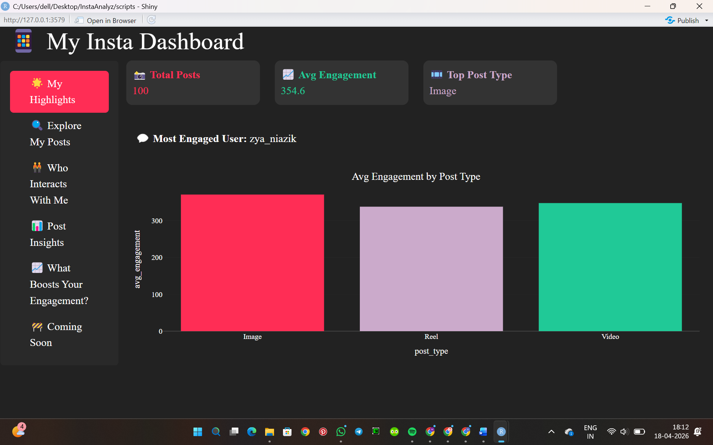
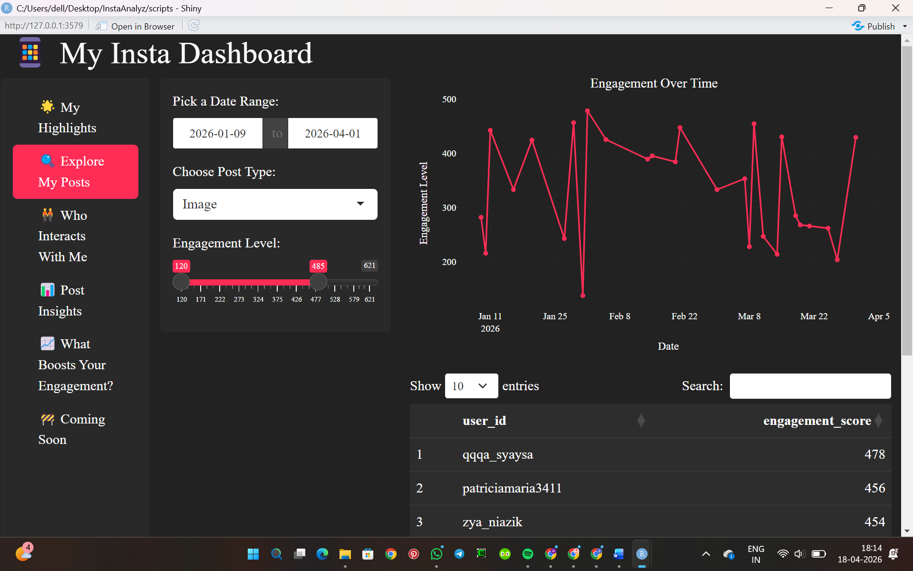
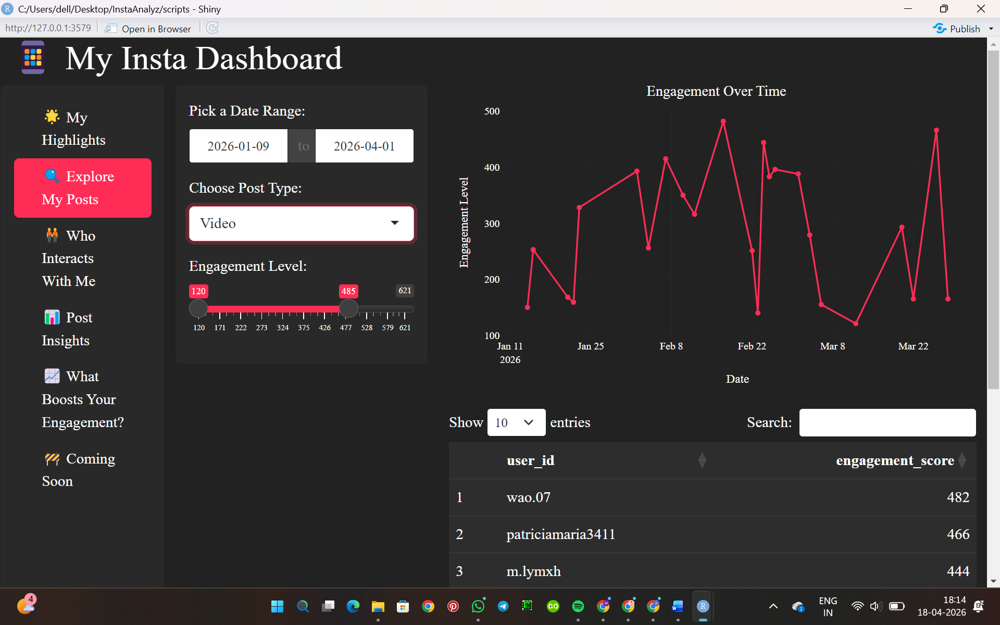
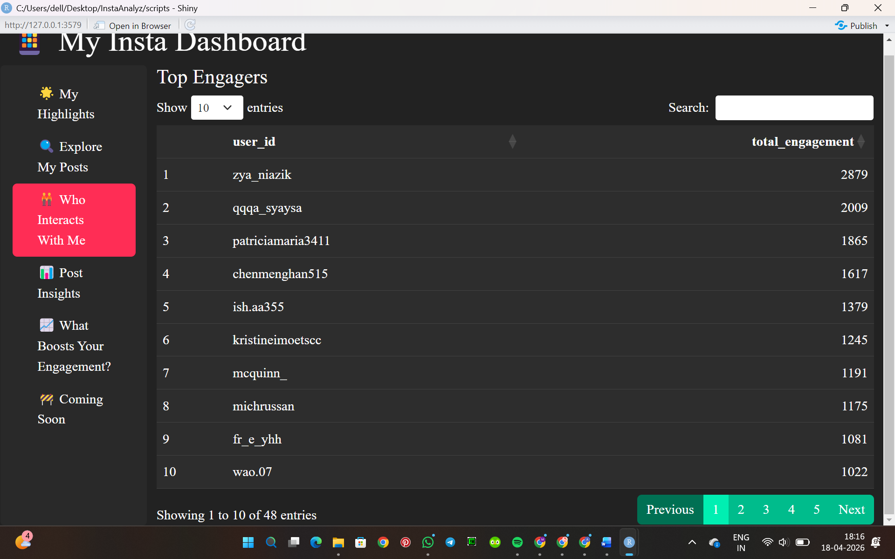
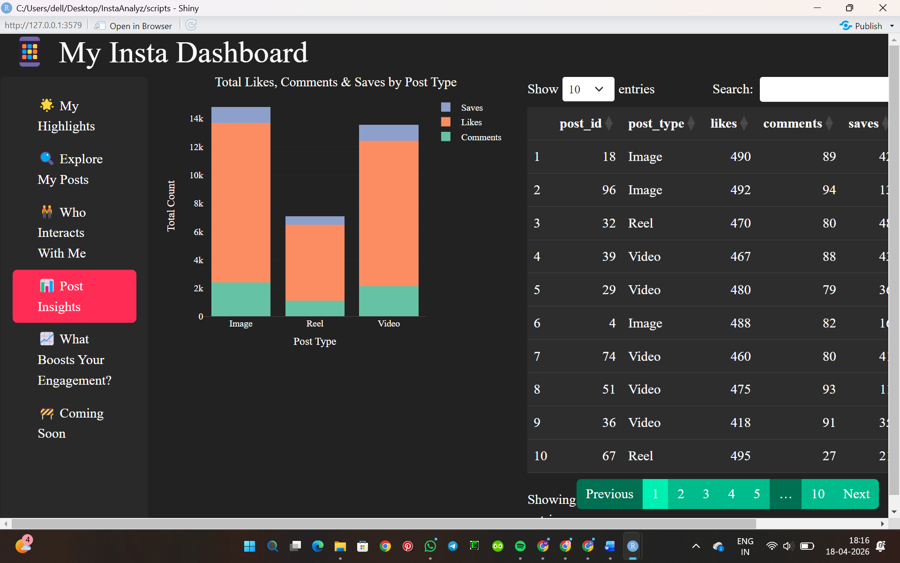
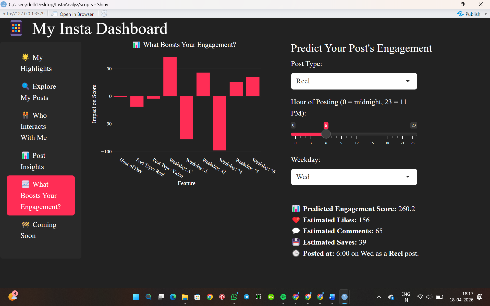

# InstaAnalyz – Instagram Analytics Dashboard 

InstaAnalyz is an interactive analytics dashboard built using R Shiny to analyze Instagram engagement patterns. It helps identify top interactors, understand content performance, and predict optimal posting strategies using machine learning.

> Includes a complete pipeline from data generation → preprocessing → analysis → interactive dashboard → engagement prediction.

---

## Dashboard Preview



---

## Features

* Interactive dashboard for engagement analysis
* Identify top users based on engagement
* Analyze engagement trends over time (date, weekday, hour)
* Visual insights using ggplot2 and Plotly
* Machine learning model to predict engagement score
* Dynamic filters for exploring posts and users

---

## Tech Stack

* R
* Shiny
* Plotly
* ggplot2
* Tidyverse
* Machine Learning (Linear Regression)

---

## Key Insights

* Identifies best time to post for maximum engagement
* Analyzes performance across different post types
* Predicts expected engagement (likes, comments, saves)

---

## Dashboard Sections

### My Highlights

Shows overall performance including total posts, average engagement, and top-performing content type.


---

### Explore My Posts

Interactively analyze engagement trends by filtering posts based on date, type, and engagement level.

#### Default View



#### Filtered View (Example: Reels / Custom Date Range)



---

### Top Interactors

Displays users ranked by their engagement level.



---

### Post Insights

Detailed breakdown of likes, comments, and saves across different post types.



---

### Engagement Prediction

Predict engagement based on different feature selections like post type, time, and weekday.

#### Default Settings


#### Modified Inputs (Example Scenario)



---

## Project Structure

* `install_packages.R` → Installs all required libraries
* `generate_data.R` → Generates synthetic Instagram dataset
* `clean_data.R` → Cleans and prepares the dataset
* `eda.R` → Performs exploratory data analysis
* `app.R` → Main Shiny dashboard application
* `data/instagram_data.csv` → Sample dataset used in the app

---

## How to Run Locally

1. Clone the repository:

```bash
git clone https://github.com/m1mallika1/instagram-interaction-analyzer.git
```

2. Open the project in RStudio

3. Install required packages:

```r
install.packages(c(
  "tidyverse",
  "lubridate",
  "ggplot2",
  "shiny",
  "plotly",
  "DT",
  "tidytext",
  "readr",
  "shinythemes",
  "bslib",
  "broom"
))
```

4. (Optional) Generate and preprocess data:

```r
source("generate_data.R")
source("clean_data.R")
source("eda.R")
```

> Note: A sample dataset is already included, so this step is optional.

5. Run the dashboard:

```r
shiny::runApp()
```

---

## Future Improvements

* Add follower growth analysis
* Include story and reel performance tracking
* Upgrade prediction model for higher accuracy
* Deploy dashboard online for public access
